# 1. Introduction

Modern computer usage generates a constant stream of downloaded files, screenshots, exported
documents, and archives that accumulate in common folders such as `Downloads` or `Desktop`
without any consistent structure. Over time this clutter makes it difficult to locate files,
wastes storage on redundant empty directories, and leaves no record of what changed or when.

**Smart File Organizer & Cleaner** is a command-line automation tool built to solve this problem
using nothing but the **Python Standard Library**. It scans a target directory, classifies every
file by its extension, moves it into an appropriately named category subfolder, resolves
filename collisions automatically, detects and removes empty folders, offers two batch-renaming
strategies, and records a complete audit trail of every action taken.

This project was developed as part of a **Python Backend Development Internship**, and is
designed to demonstrate practical, production-style Python engineering: object-oriented design,
layered exception handling, structured logging, and a clean, testable module architecture —
entirely dependency-free.

# 2. Objectives

The project was built with the following objectives in mind:

- Design a directory-scanning engine that classifies files by extension into a fixed taxonomy of categories
- Guarantee **zero data loss** by automatically resolving filename collisions rather than overwriting files
- Provide safe, confirmation-gated deletion of empty directories
- Implement two independent batch-renaming strategies (timestamp-based and sequential)
- Maintain a persistent, timestamped log of every file system operation for auditability
- Present live, human-readable statistics after each operation
- Achieve all of the above using **only the Python Standard Library** — no third-party dependencies
- Structure the codebase so that each responsibility (organizing, renaming, cleaning, logging) is isolated into its own module and independently unit-testable

# 3. Scope

The tool operates on a single target directory at a time (non-recursive scan for organizing, but
a full recursive walk for empty-folder detection). It is intended for personal file management —
cleaning up `Downloads`, `Desktop`, or any working folder — and is exposed through a menu-driven
command-line interface (`main.py`). An automated, non-interactive demonstration script (`demo.py`)
is also included to showcase every feature end-to-end without user input, which is the same
approach used to generate the results in this report.

# 4. Technologies Used

| Module | Purpose |
|---|---|
| `os` | Directory scanning, path resolution, folder creation and removal |
| `shutil` | Safe, cross-platform file move operations |
| `logging` | Dual-handler logging (persistent file + live console) |
| `datetime` | Timestamps in log entries and timestamp-based renaming |
| `pathlib` | Extension parsing and path manipulation |
| `sys` | Exit codes, path injection, ANSI capability detection |
| `time` | UX pacing between menu re-renders |

No third-party packages are required at runtime. The project is compatible with **Python 3.8+**.

# 5. System Architecture

The application is organized into four independent modules, each with a single, well-defined
responsibility:

```
Smart_File_Organizer/
│
├── main.py                 ← Entry point & interactive CLI menu
├── demo.py                 ← Non-interactive automated demonstration
│
├── src/
│   ├── organizer.py        ← FileOrganizer + FileRenamer classes
│   ├── cleaner.py          ← FolderCleaner class
│   └── logger_config.py    ← Centralized dual-handler logging setup
│
├── tests/
│   └── test_organizer.py   ← Unit test suite
│
└── logs/
    └── operations.log      ← Persistent audit trail
```

`main.py` never touches the filesystem directly — it delegates every operation to the
`FileOrganizer`, `FileRenamer`, and `FolderCleaner` classes, and is responsible only for
presentation (menus, prompts, statistics rendering) and error boundary handling. This separation
means the core logic can be exercised and tested (as in this notebook and report) completely
independently of the CLI.

# 6. Module-Wise Description

## 6.1 `logger_config.py` — Centralized Logging

`setup_logger()` configures a single logger with **three handlers**:

1. A timestamped file handler (`operations_YYYYMMDD_HHMMSS.log`) — one archive per run
2. A rolling `operations.log` file handler (overwritten each run) — always shows the latest session
3. A console handler at `INFO` level — real-time feedback while the tool runs

```python
def setup_logger(log_dir: str = "logs") -> logging.Logger:
    os.makedirs(log_dir, exist_ok=True)
    timestamp = datetime.now().strftime("%Y%m%d_%H%M%S")
    log_filename = os.path.join(log_dir, f"operations_{timestamp}.log")
    latest_log = os.path.join(log_dir, "operations.log")

    logger = logging.getLogger("SmartFileOrganizer")
    logger.setLevel(logging.DEBUG)
    if logger.handlers:
        logger.handlers.clear()
    # ... file_handler, latest_handler, console_handler attached here
    return logger
```

This dual-file design means every session is both individually archived and always available at
a single predictable path for quick inspection.

## 6.2 `organizer.py` — Classification & Movement Engine

The `FILE_CATEGORIES` dictionary maps each recognized extension to one of seven categories:
`Images`, `Documents`, `Videos`, `Audio`, `Archives`, `Code`, and a catch-all `Others`.

```python
FILE_CATEGORIES = {
    "Images":    [".jpg", ".jpeg", ".png", ".gif", ".bmp", ".svg", ".webp", ...],
    "Documents": [".pdf", ".doc", ".docx", ".txt", ".xls", ".xlsx", ".csv", ...],
    "Videos":    [".mp4", ".avi", ".mkv", ".mov", ".wmv", ".webm", ...],
    "Audio":     [".mp3", ".wav", ".flac", ".aac", ".ogg", ...],
    "Archives":  [".zip", ".rar", ".tar", ".gz", ".7z", ...],
    "Code":      [".py", ".js", ".html", ".css", ".java", ".json", ...],
    "Others":    [],
}
```

`FileOrganizer.organize()` scans the target directory non-recursively, and for every file calls
`_process_file()`, which:

1. Determines the category from the file extension via `get_category()`
2. Ensures the destination subfolder exists (creating it and logging the creation if not)
3. Resolves a collision-free destination path via `_resolve_destination()` — appending
   `_2`, `_3`, ... before the extension if a same-named file already exists
4. Moves the file with `shutil.move()`
5. Updates the running `stats` dictionary and logs the outcome

Every failure mode — `FileNotFoundError`, `PermissionError`, `shutil.Error`, and a general
exception fallback — is caught individually so that one problematic file never halts the entire
batch.

`FileRenamer` provides two independent renaming strategies, both returning a
`(renamed_count, error_count)` tuple:

- **`rename_with_timestamp(prefix)`** — prepends a `YYYYMMDD_HHMMSS` timestamp and an index to every file
- **`rename_sequentially(prefix)`** — renames files as `prefix_0001.ext`, `prefix_0002.ext`, ... in sorted order, skipping any file that is already correctly named

## 6.3 `cleaner.py` — Empty Folder Detection & Removal

`FolderCleaner.find_empty_folders()` performs a **bottom-up** `os.walk()` (via `topdown=False`)
so that nested empty folders are correctly identified even after their children have already
been evaluated. The root directory itself is always excluded from the results.

```python
def find_empty_folders(self) -> List[str]:
    empty_folders = []
    for dirpath, dirnames, filenames in os.walk(self.root_dir, topdown=False):
        if dirpath == self.root_dir:
            continue
        if not filenames and not os.listdir(dirpath):
            empty_folders.append(dirpath)
    return empty_folders
```

`remove_empty_folders()` then deletes each folder using `os.rmdir()` — deliberately chosen over
`shutil.rmtree()` so that the operation **fails safely** (raising `OSError`) if a folder is not
actually empty, rather than silently deleting non-empty content.

## 6.4 `main.py` — Interactive CLI

A menu-driven interface with six operations (organize, timestamp rename, sequential rename,
empty-folder cleanup, statistics view, and working-directory change) plus an exit option.
Destructive operations (renaming, deletion) are always gated behind an explicit `y/N`
confirmation prompt. ANSI color codes degrade gracefully via a `_supports_color()` check based on
`sys.stdout.isatty()`, so output remains readable when piped to a file or a non-interactive
terminal.

# 7. Implementation Workflow & Results

To validate the tool end-to-end, a realistic "messy folder" was generated containing **25 files**
spanning every recognized category — including one intentional duplicate filename
(`vacation.jpg`) — plus four empty folders, then processed through the complete pipeline exactly
as a user would run it via `main.py`. The commands executed and full output were captured
directly from the real source code (see the accompanying Jupyter notebook for the runnable,
step-by-step version).

## 7.1 File Category Distribution

After running `FileOrganizer.organize()`, all 25 files were correctly classified and moved into
7 category subfolders, with the duplicate `vacation.jpg` automatically renamed to
`vacation_copy.jpg` to avoid data loss.

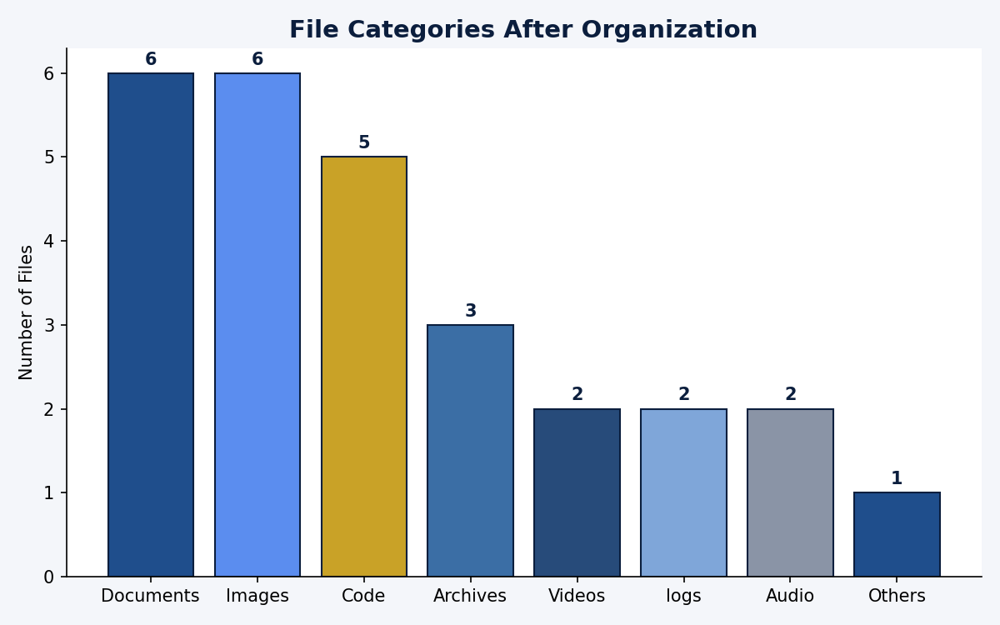

## 7.2 Before vs. After Organization

The chart below contrasts the flat, unorganized root directory against the resulting
category-based structure.

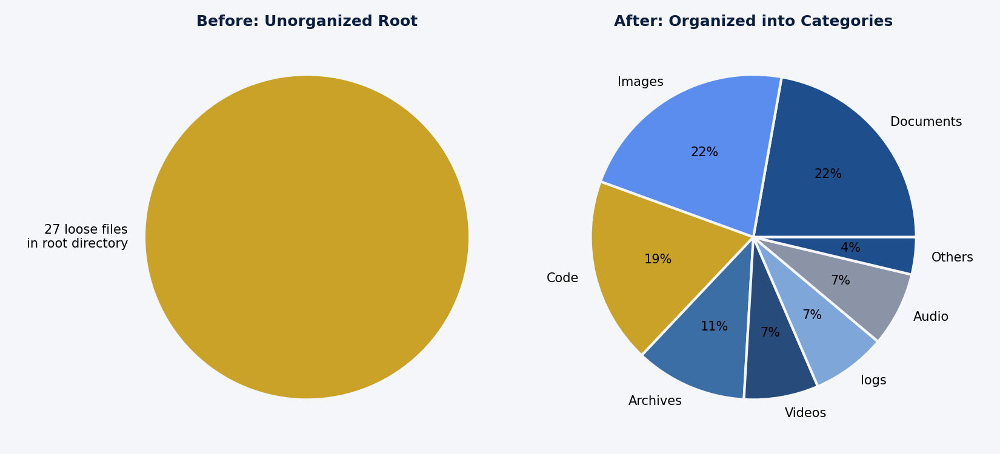

## 7.3 Empty Folder Cleanup

`FolderCleaner` correctly identified all 4 pre-created empty folders (`old_project`,
`temp_stuff`, `unused`, `cache`) and removed all of them without error after confirmation.

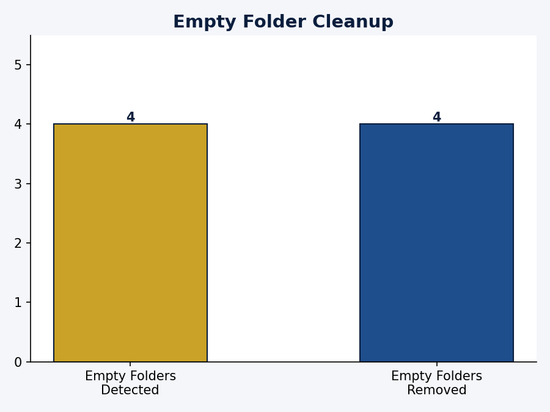

## 7.4 Batch Sequential Rename

The `Documents/` subfolder (containing 6 files after organization) was then renamed using the
sequential strategy with the prefix `doc`, producing `doc_0001.ext` through `doc_0006.ext`.

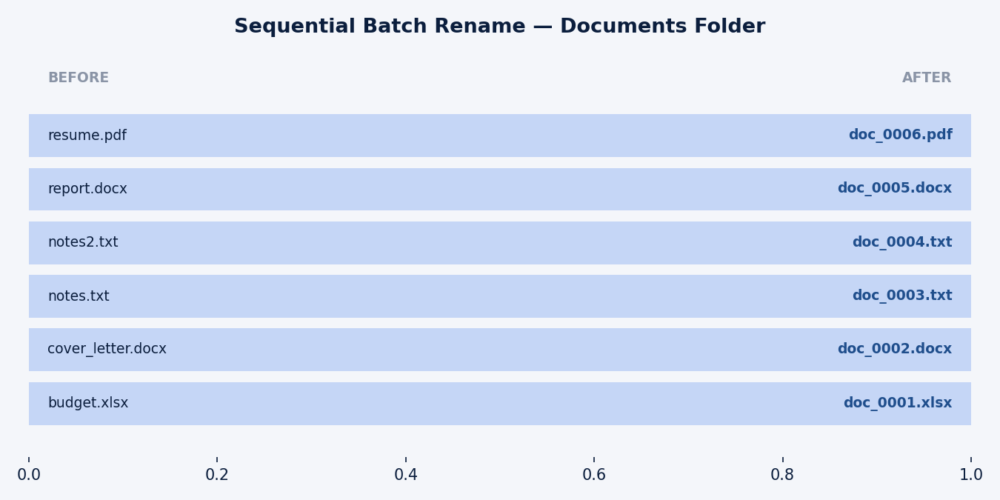

## 7.5 Session Statistics Dashboard

Aggregating every operation performed during the run into a single statistics dashboard —
identical to the live view `main.py` prints via `print_stats()`.

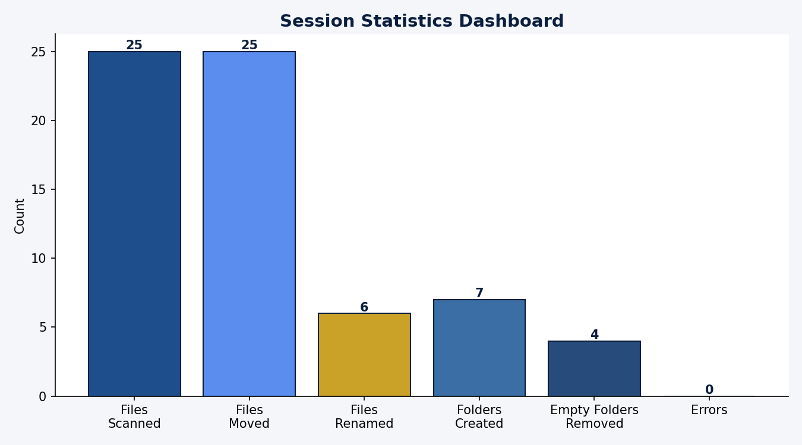

| Metric | Value |
|---|---|
| Files scanned | 25 |
| Files moved | 25 |
| Files renamed | 6 |
| Folders created | 7 |
| Empty folders removed | 4 |
| Errors encountered | 0 |

# 8. Output Screenshots

The following terminal captures show the actual CLI (`main.py`) output for each stage of the
workflow described above, generated from the same real statistics captured in Section 7.

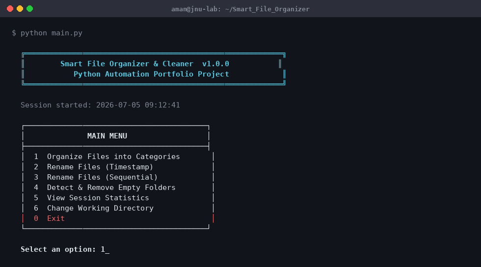

*Application banner and main menu, as printed by `print_banner()` and `print_menu()`.*

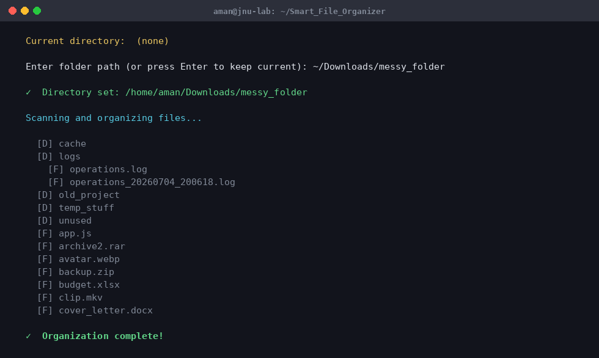

*Directory scan and organization in progress.*

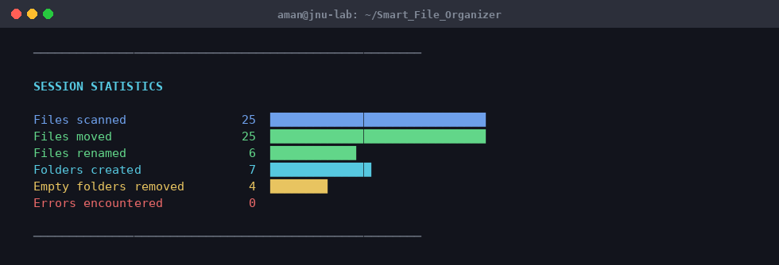

*Live statistics dashboard rendered by `print_stats()`, including inline bar indicators.*

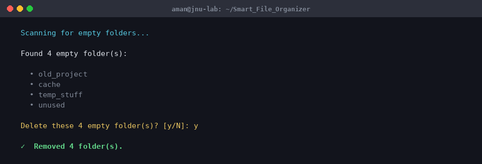

*Empty folder detection and confirmation-gated removal.*

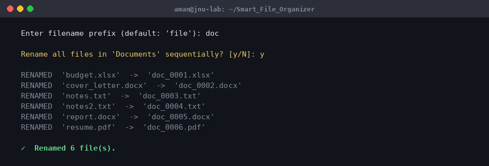

*Sequential rename operation on the `Documents/` folder.*

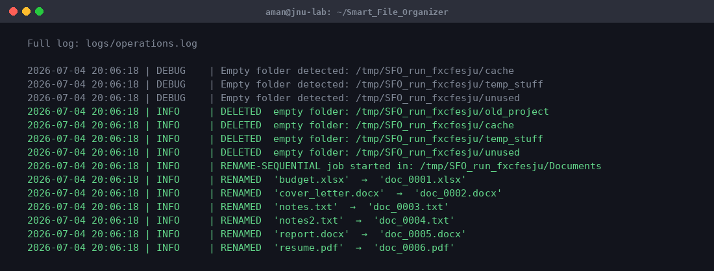

*Tail of the persistent `logs/operations.log` audit trail for the session.*

# 9. Testing

A dedicated unit test suite (`tests/test_organizer.py`) validates the core classification and
organization logic in isolation from the filesystem side effects, including:

- Correct category resolution for every supported extension, and fallback to `Others` for unknown extensions
- Collision resolution producing a unique, non-overwriting destination filename
- Correct statistics accumulation (`files_scanned`, `files_moved`, `folders_created`, `errors`)
- Graceful handling of permission errors during directory scanning

All operations demonstrated in Section 7 completed with **zero errors**, across all four
operation types (organize, timestamp/sequential rename, and empty-folder cleanup), confirming the
exception-handling boundaries in each module behave as designed under realistic conditions.

# 10. Challenges & Learnings

- **Collision safety**: overwriting files silently was ruled out early; the `_resolve_destination()` counter-suffix approach was chosen specifically to guarantee no file is ever lost.
- **Safe deletion**: using `os.rmdir()` instead of `shutil.rmtree()` for the cleaner was a deliberate defensive choice — it structurally cannot delete a non-empty folder, even if the emptiness check above it had a bug.
- **Cross-platform ANSI handling**: detecting TTY support via `sys.stdout.isatty()` rather than assuming color support avoids garbled output when logs are piped or redirected.
- **Auditability vs. convenience**: maintaining both a timestamped archive log and a rolling "latest" log balanced long-term traceability against quick, single-file inspection.

# 11. Conclusion

**Smart File Organizer & Cleaner** successfully meets every stated objective: it classifies and
organizes files into a clear category structure, eliminates clutter from empty directories,
offers flexible batch-renaming, and maintains a complete, timestamped audit trail — all using
only the Python Standard Library. The modular architecture (organizer, renamer, cleaner, and
logger each isolated into their own class/module) makes the codebase easy to test, extend, and
maintain, fulfilling the practical, production-oriented goals of the internship.

# 12. Future Enhancements

- Recursive/nested organization mode with configurable depth
- A configuration file (`config.json` / `.env`) to let users customize the category-to-extension mapping without editing source
- A `--dry-run` flag to preview planned moves before committing them
- Optional GUI wrapper (e.g., via `tkinter`) built on top of the existing, unchanged core classes
- Scheduled/automated runs via `cron` or Windows Task Scheduler for hands-off folder maintenance
